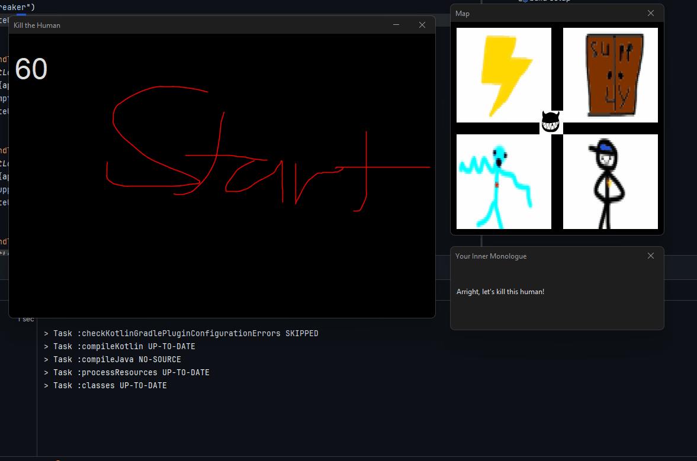
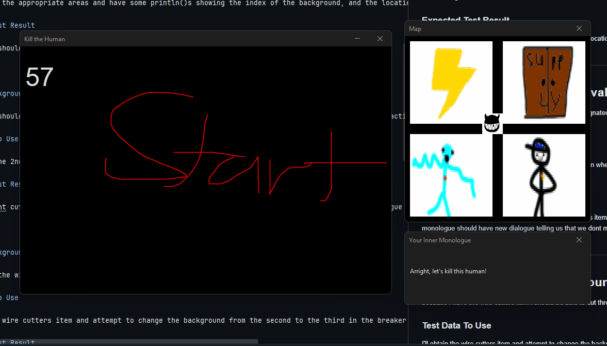
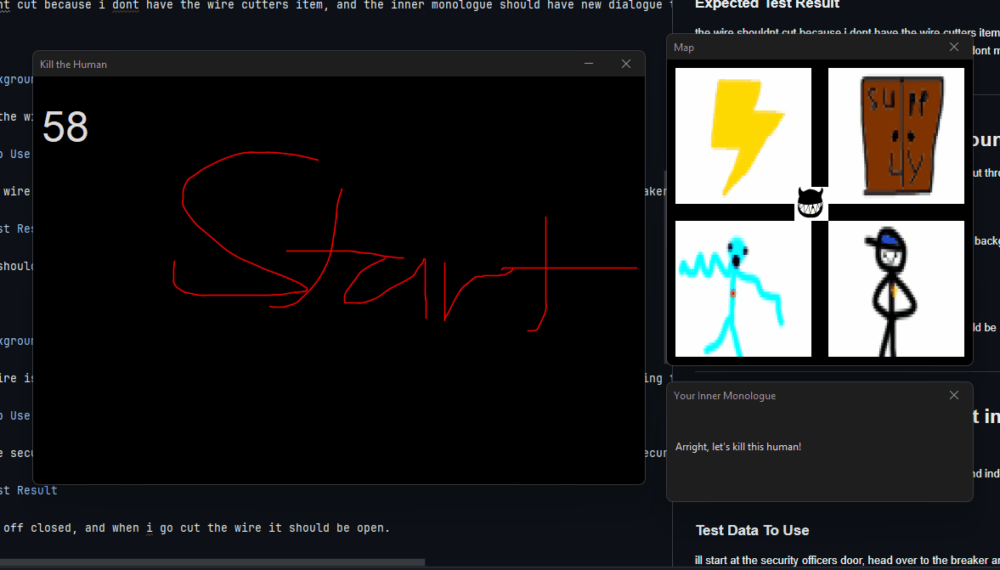
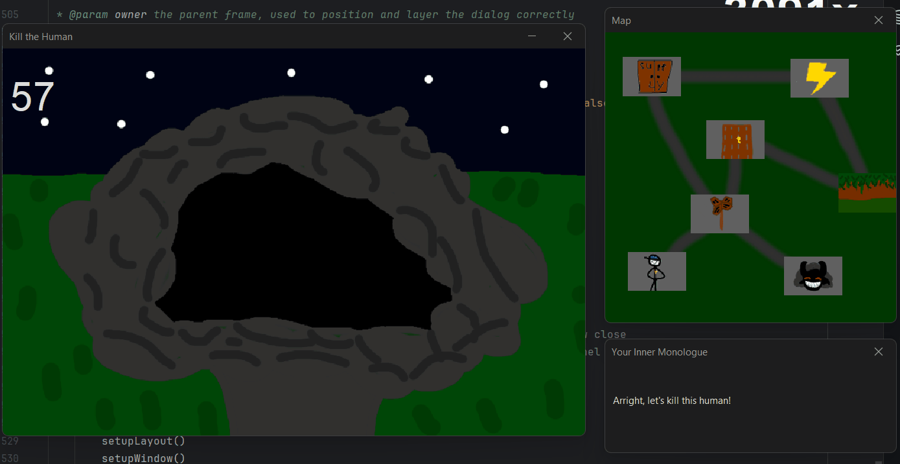
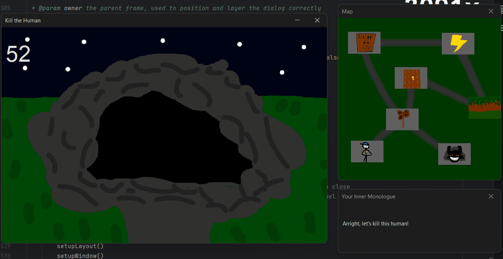
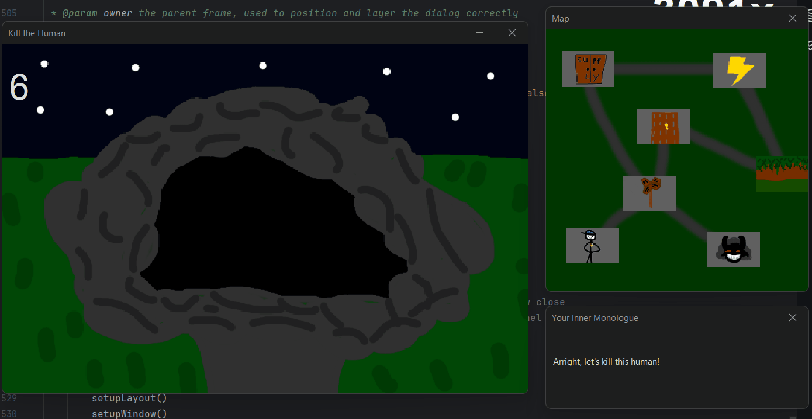

# Results of Testing

The test results show the actual outcome of the testing, following the [Test Plan](test-plan.md)

---

## Map Movement

testing if movement between different locations is possible

### Test Data Used

I clicked on the different panels moving me between different locations

### Test Result

Works as intended

---

## Changing background test (valid)

testing if the background changes when i click on the appropriate areas. This represents progressing through a location

### Test Data Used

I'll click on the set areas where there isn't a requirement/I've met the requirements and we'll see if the background changes appropriately.

### Test Result

Works as intended

---

## Changing background test (boundary)

testing if boundary requirements of changing a background work.

### test data used

I'll click on specifically the blue wire part, which requires only the wirecutters technically making it a boundary input.

### test result

works as intended

---

## Changing background test (invalid)

testing if attempting to change background whilst not meeting requirements work.

### Test data used

I'll click on the blue wire **without** the wire cutters, which shouldn't work and inner monologue should say something is needed

### Test result

works as intended

---

## Changing background without direct interaction

when the blue wire is cut, it should change the background of the office without directly interacting with that specific location

### test data used

I'll cut the wire and check the office

### test result

works as intended

---

## Invalid map movement

with the new map, you should only be able to move to locations connected by path

### test data used

I'll attempt to move all over the place, including invalid areas

### test result

works as intended

---

## Winning

you win after killing the security officer. This should only result in the timer stopping

### test data used

I'll win and see what happens

### test result

works as intended

---

## Losing

you lose after time runs out. This should set currentLocation to a special lose location, stop the timer and delete the map so the player cant move off the lose location

### test data used

ill run the timer out

### test result

works as intended

---